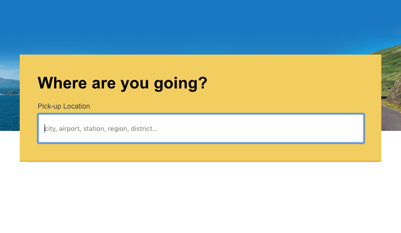

# Rentalcars Tech Test

Objective: Create a Pick-up Location input box and apply styling and search functionality 

The test uses pure HTML, JavaScript and Rentalcars own CSS and is not reliant on frameworks  

## To run, from parent directory type 
``npm install``
``npm start``

## To run Cypress tests, from the parent directory type
``npm test``
Wait for Cypress to load and select search_widget_spec 

## Dependencies
- axios (https://github.com/axios/axios)
- Cypress (https://www.cypress.io/)
- http-server (https://www.npmjs.com/package/http-server)
